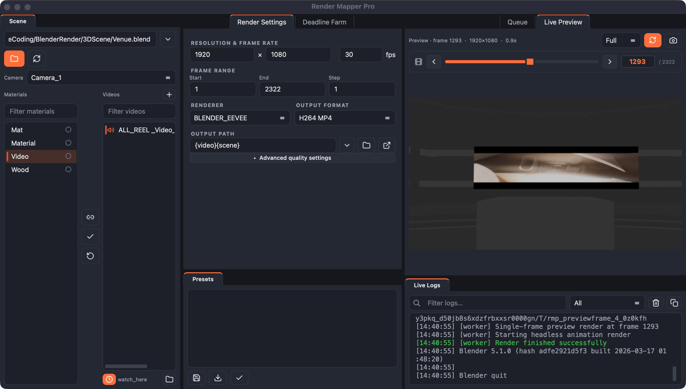

# Render Mapper Pro

A standalone desktop app that maps videos onto 3D‑scene materials and renders them headlessly — built for LED‑wall / screen‑content workflows where one scene drives many video surfaces.

It supports **two render backends**, chosen automatically by scene type: **Blender** (`.blend`, `.fbx`, `.usd`, …) and **Cinema 4D + Redshift** (`.c4d`). It runs the renderer in the background, so a renderer crash can never take down the app, and ships bundled static `ffmpeg`/`ffprobe` so audio muxing and clip probing work out of the box.



## Download

Grab the latest from the [**Releases**](../../releases) page. The **installer** is the easy path; the **portable** zip is a no‑install folder you can run from anywhere.

| Platform | Installer (recommended) | Portable |
|----------|-------------------------|----------|
| Windows (x64) | `RenderMapperPro-Windows-x64-Setup.exe` | `RenderMapperPro-Windows-x64.zip` |
| macOS (Apple Silicon) | `RenderMapperPro-macOS-arm64.dmg` | `RenderMapperPro-macOS-arm64.zip` |

- **Windows:** run **Setup.exe** — it installs to Program Files with a Start‑Menu shortcut. If SmartScreen warns, **More info → Run anyway** (the build isn't code‑signed).
- **macOS:** open the **.dmg** and drag the app to **Applications**. First launch only: right‑click the app → **Open** → **Open** (it isn't notarized).
- **Updates are automatic:** on launch the app checks Releases and, with one click, downloads and runs the right installer for you — no manual replace.

**Nothing else to install.** The app is self-contained: **ffmpeg** is bundled, the `.glb` web renderer fetches its own headless Chromium on first use, and if **Blender** isn't already on the machine the app offers to **download a managed Blender runtime** for you (one click, with a progress bar). The only "bring your own" is **Cinema 4D + Redshift** for `.c4d` scenes — that's licensed commercial software, so you point the app at your own install.

Every push to `main` also publishes the builds as downloadable **workflow artifacts** under the GitHub Actions run.

## Quick start

1. **Add a scene** — drag a `.blend` / `.c4d` / `.glb` (or `.fbx`, `.usd`, …) onto the Scene box, then click **Scan Scene**.
2. **Add clips** — drag your videos into the Videos list and pick a **Camera**.
3. **Link them** — click **Auto‑map** to match clips to materials by name, or link a selected pair by hand.
4. **Set the output** — it auto‑fills next to each clip; adjust resolution, frame range and format.
5. **Queue & render** — hit **Queue**, then **Start** (`⌘/Ctrl+R`), and watch the live preview — or send it to a farm.

> New to the app? The in‑app **Help → Quick Start** is a click‑through version of this with links straight to the relevant settings.

## What it does

### Map & render
- Load a 3D scene — **Blender** (`.blend`, `.fbx`, `.obj`, `.glb`, `.usd`, `.abc`, …) or **Cinema 4D** (`.c4d`) — plus one or many videos.
- **Scan** the scene to populate materials and cameras, pulling its own render settings (fps, frame range, resolution, engine, samples, and for C4D the Redshift sampling) straight into the UI.
- Map videos onto materials (full‑bright **emission** or **base‑color/alpha**); multiple video→material pairs render in a single pass, at **full quality** (cubic sampling, texture‑size limits off, no mip down‑scaling).
- **Renderer‑aware settings** — the panel adapts to the active engine so every control is real:
  - **Blender:** Cycles/EEVEE, samples, denoise, device, colour transform/exposure/gamma, transparent.
  - **Redshift:** Speed Preset (Draft→Final), Max/Min samples, adaptive Noise Threshold, denoise, GI bounces / on‑off, Max Ray Depth.
- Output profiles: **H.264 MP4**, **ProRes MOV**, **PNG/EXR** sequence — movie outputs are **Rec.709**‑tagged (+faststart) so they look identical everywhere.
- Per‑clip **audio** (speaker badge to mute/include) and an optional **burn‑in overlay** stamping clip/version/frame/camera/date onto every frame.

### Automate the busywork
- **Auto‑map by name** — clips link to materials when the material name appears in the filename (on import or on demand); gap‑fill only, never clobbers a manual link.
- **Watch folder** — drop clips into a folder and they import + map themselves. Version‑aware (`Screen_v1`/`v2`/`_3` → latest wins), auto‑updating the project; half‑copied files are skipped until complete.
- **Auto‑render targets** — mark the screens a render must cover; once the watch folder fills every target (or a newer version lands) a single multi‑screen render queues automatically with a `PREVIZ` suffix. Queue‑only or auto‑start.
- **Auto‑retry** a failed job once, and an **aspect guard** that warns when footage doesn't match its screen (16:9 clip on a 21:9 wall).
- **Delivery copy** — finished renders can copy themselves into a review/delivery folder.
- **Automatic updates** — the app checks Releases on launch and one‑click downloads + runs the right installer. The repo is public, so this uses the anonymous GitHub API — **no credential is baked into the build**.

### Scale to a farm
- **Thinkbox Deadline** — submit Blender *and* Cinema 4D jobs. C4D jobs are baked and rendered with the licensed Cinema 4D command‑line renderer; jobs carry the app icon in the Deadline Monitor and spread frames across nodes. **Auto‑chunking** sizes frames‑per‑task from render history; *Deadline → Farm Nodes…* lists the farm; right‑click a job to **Set Priority** or **Requeue**.

### Review & track
- **Analytics & cost** — every render records seconds/frame, total time and estimated power **cost** (set wattage + rate in *Tools → Power & Cost*), shown live and in *Tools → Render History*, with an upfront ETA from prior runs.
- **Output review** — auto‑generated **contact sheets** per render and a shareable **HTML report** with timing, cost and embedded thumbnails.
- **Notifications** — pinged on complete/fail via the system tray and/or a **Discord webhook**; everything also logs to Live Logs.
- **Command palette** (**⌘/Ctrl+K**) to run any action by name, plus a **light/dark** theme toggle.

### Live Preview

- Pick any frame with the **frame scrubber** (prev/next, slider, frame field) and render just that frame — fast, at a chosen **render scale** (Full / ½ / ¼ / ⅛).
- **Auto** mode re‑renders the preview whenever you change the camera, resolution, frame, mapping, etc. (debounced, and coalesced so updates never pile up).
- **Display zoom** like After Effects: **double‑click toggles Fit ⇄ 100%**, centred on the clicked pixel; **grab to pan** at 100%. The image scales to the panel in Fit.
- Shows render **time and pixel size**; the finished movie plays (looped) in the same pane after a full render.

### Queue

- **Auto‑draft:** the moment you map a video it becomes a live job; edits save into it continuously — no "unsaved changes" limbo, no save dialog.
- Always exactly **one active job** (remembered across sessions); selecting a row opens it, switching never loses work.
- **Double‑click a job name to rename** (sticks; auto‑labels are tagged with the camera otherwise).
- New jobs are added at the **top**; **⌘/Ctrl+D** duplicates, **Delete** removes, right‑click for Duplicate / Set Priority / Requeue / Reveal / Open / Move / **Clear Queue**.
- Per‑row **Run** checkbox and progress; live, filterable logs (text + level filters).

## Project / preset files

- **Projects** — `.rmproj` (full setup: scene, clips, mappings, queue).
- **Presets** — `.rmpreset` (reusable render‑settings recipe).

Both are JSON under the hood. App data lives in `~/.blender_video_mapper/`:
`profile.json` (auto‑saved state), `presets/*.rmpreset`, `logs/app_qt.log`, `reports/`.

## Project structure

- `app_qt.py` — the Qt (PySide6) desktop UI.
- `theme.py` / `icons.py` — dark theme tokens + SVG icon set that drive all styling.
- `blender_worker.py` / `blender_discover.py` — headless Blender render + scene discovery.
- `c4d_worker.py` / `c4d_discover.py` — headless Cinema 4D + Redshift render/bake + discovery (run under `c4dpy`).
- `deadline/RenderMapperPro/` — custom Deadline plugin (app icon + cross‑platform C4D Commandline render); installed into the repository's `custom/plugins/`.
- `core/` — UI‑agnostic logic: `models.py` (job config), `runner.py` (subprocess + Deadline submission), `discovery.py`, `utils.py` (output paths, name auto‑match, version reconciliation).
- `tests/` — pytest suite for `core/` (matching, versioning, runner, Deadline submission).
- `BlenderVideoMapper.spec` — PyInstaller build spec (bundles both workers + ffmpeg).

## Run from source

Requires Python 3.12 and Blender installed.

```bash
python -m pip install -r requirements-build.txt   # PySide6 + PyInstaller
python tools/fetch_ffmpeg.py                       # vendored ffmpeg/ffprobe
python app_qt.py
```

Then set the Blender executable in **Properties** (e.g. `/Applications/Blender.app/Contents/MacOS/Blender`), pick a scene, **Scan**, add videos, map them, and use **Preview Frame** / the queue.

## Build a standalone app

```bash
python -m pip install -r requirements-build.txt
python tools/fetch_ffmpeg.py
python -m PyInstaller --noconfirm --clean BlenderVideoMapper.spec
# → dist/Render Mapper Pro.app  (macOS)  /  dist/Render Mapper Pro/  (Windows)
```

GitHub Actions (`.github/workflows/build.yml`) does this for macOS (Apple Silicon) + Windows on every push to `main`. The Windows job also compiles a `Setup.exe` with **Inno Setup** and the macOS job builds a `.dmg` (see `installer/`); pushing a `v*` tag publishes a Release with both the installers and the portable zips. _(macOS is Apple-Silicon-only — the deprecated Intel runner build was dropped; a universal2 build is the path back to Intel support if needed.)_

## Development

```bash
pip install pytest ruff
pytest -q                                           # unit tests
ruff check core tests blender_worker.py blender_discover.py
```

CI runs the same lint + tests as a gate before the build matrix.

## Blender notes

- The worker creates/updates `AUTO_VIDEO_TEXTURE` nodes per mapped material; emission mode wires the clip to an emission shader so screens stay fully visible.
- Video clips map over the full timeline; the single‑frame preview renders one scene frame while keeping that timeline in sync.
- Timeout / idle‑timeout controls can terminate stalled runs; safe mode validates paths/extensions in the worker.

## Cinema 4D + Redshift notes

- Requires Cinema 4D 2026 (auto‑detected via `c4dpy`) with Redshift; the clip is injected into the target material's **Redshift emission** as a full‑bright image sequence (Redshift can't read `.mp4`, so frames are extracted with the bundled `ffmpeg`).
- **Local renders/preview** run under `c4dpy`. **Farm renders** bake a self‑contained `.c4d` (relative sequence paths) and render it with the licensed Cinema 4D **Commandline** — so any node that already renders C4D works, with no extra licensing setup.
- **Farm prerequisites:** each render node needs Cinema 4D + Redshift licensed (as for the stock Cinema4D plugin). The `RenderMapperPro` Deadline plugin lives in `deadline/RenderMapperPro/` and is installed into the repository's `custom/plugins/`.
