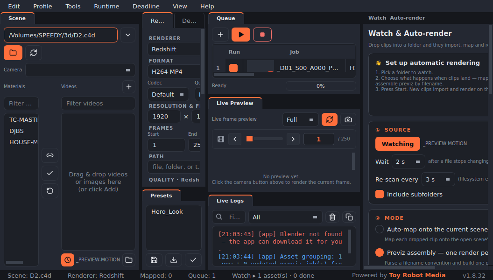
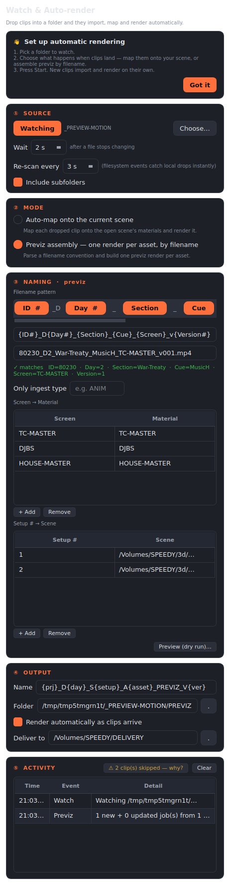
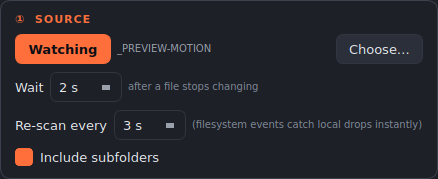
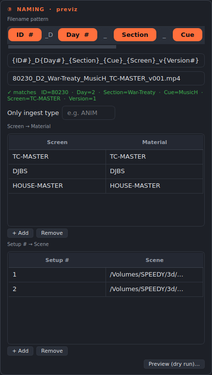
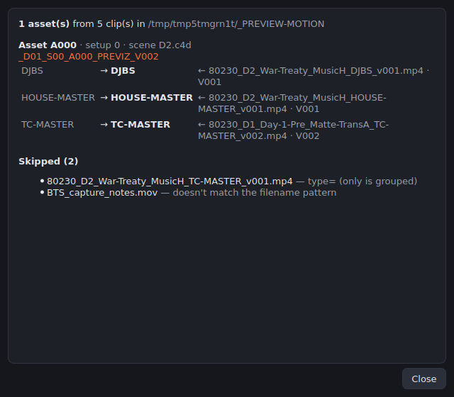
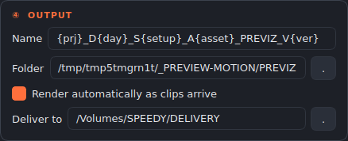
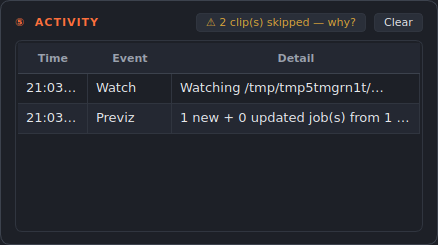
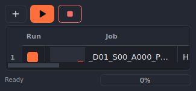

# Render Mapper Pro — User Guide

Map video clips onto a 3D scene's materials and render them headlessly — via
**Blender**, **Cinema 4D + Redshift**, or the built-in **three.js** web
renderer — locally or on a Thinkbox Deadline farm.



This guide is also built into the app: **Help → User Guide** (with the same
screenshots and clickable links into the relevant settings).

---

## Table of contents

1. [Quick start](#quick-start)
2. [Watch & Auto-render](#watch--auto-render)
   - [① Source](#-source--what-to-watch)
   - [② Mode](#-mode--what-happens-to-a-clip)
   - [③ Naming](#-naming--teach-it-your-convention)
   - [④ Output & delivery](#-output--delivery)
   - [⑤ Activity](#-activity--trust-but-verify)
3. [Filename pattern reference](#filename-pattern-reference)
4. [The queue](#the-queue)
5. [Render engines](#render-engines)
6. [Crash reports](#crash-reports)
7. [Troubleshooting & FAQ](#troubleshooting--faq)

---

## Quick start

1. **Add a scene** — drag a `.blend`, `.c4d`, `.glb`/`.gltf` file onto the
   Scene box and click **Scan Scene**. Its materials appear in the list.
2. **Add clips** — drag videos into the Videos list, pick a **Camera**.
3. **Map** — drag a clip onto a material (or use **Auto-match**, which pairs
   clips to materials by name).
4. **Render** — check the output settings in the Render panel and press
   **Render**. Progress, ETA and logs are live; finished renders can open,
   reveal, or copy themselves to a delivery folder automatically.
5. **Automate it** — open **View → Watch & Auto-render** and let the app do
   steps 2–4 by itself whenever a clip lands in a folder. That's the rest of
   this guide.

---

## Watch & Auto-render

The Watch panel is a single automation rule that reads top to bottom:
**① Source → ② Mode → ③ Naming → ④ Output → ⑤ Activity.**



### ① Source — what to watch



Click **Choose…**, pick the folder, press **Start**.

| Setting | What it does |
|---|---|
| **Wait** | How long a file must stop changing before it's imported — so a clip that's still copying is never grabbed half-written. Raise it for very large files arriving over slow links. |
| **Re-scan every** | The backstop poll. Local drops are caught instantly by filesystem events; the poll covers network shares (SMB/NFS) and cloud folders where events don't fire. It backs off automatically when the folder is quiet. |
| **Include subfolders** | Watch the whole tree — clips dropped into per-day/per-setup subfolders are picked up too. The render output folder is always excluded, so renders never re-trigger themselves. |

**Cloud-aware:** Dropbox/OneDrive *online-only* placeholder files are detected
and skipped until their bytes are actually on disk.

### ② Mode — what happens to a clip

| Mode | Behaviour |
|---|---|
| **Auto-map** | Each clip maps onto the *current scene's* material with the matching name. Once every render-target screen has a clip, one multi-screen render is queued (a burst of arrivals coalesces into a single render). `Screen_v2.mp4` landing next to `v1` takes over the mapping — **latest wins**. |
| **Assemble previz** | For shows with a filename convention: clips group into **one render per asset**, each routed to its setup's scene file. Drop 10 clips → get 5 assembled previz jobs. |

### ③ Naming — teach it your convention

*(Previz mode only — the card hides in auto-map mode.)*



Build the filename pattern from **chips** — no regex. Paste a real filename
into the sample box and the live preview shows exactly which fields parse:

```
Pattern:  {ID#}_D{Day#}_{Section}_{Cue}_{Screen}_v{Version#}
Sample:   80230_D2_War-Treaty_MusicH_TC-MASTER_v001.mp4
Result:   ✓ matches   ID=80230 · Day=2 · Section=War-Treaty · Cue=MusicH ·
          Screen=TC-MASTER · Version=1
```

If it doesn't match, the preview says *where* it stopped and what it expected
(`Stopped after "80230_D" — expected a number for 'Day'`) — so fixing the
pattern never requires understanding regular expressions.

| Table | What it does |
|---|---|
| **Screen → Material** | Which scene material each screen code drives. Leave a screen out and it defaults to the material with the same name. |
| **Setup # → Scene** | Routes each setup number to its own scene file (`D1.c4d`, `D2.c4d`, …). Setups without a mapping use the currently loaded scene. |

**Versioning:** newest wins. A `v002` landing after `v001` *updates the
existing job in place* — jobs never pile up per version.

**Preview (dry run)** shows exactly what *would* assemble — per asset:
screen → material → clip → version — plus every skipped clip and the reason,
before anything renders:



### ④ Output & delivery



- **Output name** supports tokens (e.g. `{prj}_D{day}_S{setup}_A{asset}_PREVIZ_V{ver}`).
- **Output folder** blank = a `PREVIZ` subfolder inside the watch folder
  (always excluded from scanning).
- **Start renders automatically** on = fully hands-off; off = jobs queue and
  wait for you.
- **Delivery folder** — every finished render is also copied there (a synced
  review folder, a hand-off share…). Blank = off.

### ⑤ Activity — trust, but verify



- **Skipped badge** — clips that did **not** become jobs (name doesn't match,
  screen not mapped, superseded by a newer version) are *counted, not
  swallowed*: click **"N clip(s) skipped — why?"** and the dry run explains
  every file.
- **Ingest history** — the feed writes through to
  `~/.blender_video_mapper/logs/ingest_history.log` and reloads on launch, so
  *"did that clip get picked up last night?"* always has an answer. **Clear**
  empties the visible list only; the on-disk history stays.

> **The full pipeline:** watch folder on the production share + previz mode +
> auto-start + delivery folder = clip lands → parsed → assembled → rendered →
> copy appears in the review folder. Zero clicks.

---

## Filename pattern reference

| Token | Meaning | Example match |
|---|---|---|
| `{Name}` | Text field (letters, digits, hyphens) | `TC-MASTER`, `War-Treaty` |
| `{Name#}` | Number field (leading zeros fine, parsed as int) | `001` → 1 |
| `{Name?}` / `{Name#?}` | Optional field — may be absent | — |
| anything else | Literal text, matched case-insensitively | `_`, `D`, `v` |

- The file extension is ignored automatically (`.mp4`, `.mov`, …).
- Each field name can be used once per pattern.
- Special field names the previz assembler understands: **Screen** (→
  material), **Setup** (→ scene routing), **Version** (→ newest wins),
  **Type** (→ "Only ingest type" filter), **Asset**/**Project**/**Day**
  (grouping + output-name tokens). Missing Setup/Asset fields simply group
  everything into one asset per (project, day) — fine for simpler shows.

**Real-world example** (a touring show's `_PREVIEW-MOTION` folder):

```
{ID#}_D{Day#}_{Section}_{Cue}_{Screen}_v{Version#}

80230_D1_Day-1-Pre_Matte-TransA_DJBS_v001.mp4
80230_D2_War-Treaty_MusicH_TC-MASTER_v001.mp4
80230_D2_War-Treaty_MusicH_HOUSE-MASTER_v002.mp4
```

---

## The queue



Every render is a job: reorder, duplicate, rename, set priority, requeue.
Labels show the **resolved output filename**. Batch-queue the current mapping
across many clips, or let the watch folder feed the queue for you. Finished
jobs report duration, per-frame metrics and estimated power cost, and can
notify you (desktop notification or Discord webhook) when done.

## Render engines

| Engine | Scene files | Notes |
|---|---|---|
| **Blender** (Cycles/Eevee) | `.blend` | The app can download and manage its own Blender — nothing to install. |
| **Cinema 4D + Redshift** | `.c4d` | Uses your installed C4D (`c4dpy`); Redshift settings honoured. |
| **Web (three.js)** | `.glb` / `.gltf` | Fully built-in headless renderer — no external DCC needed. |
| **Deadline farm** | both | Submit Blender and C4D jobs to a Thinkbox Deadline repository. |

## Crash reports

If the app ever crashes — even a hard native crash — the next launch offers
the report: view it, or open a prefilled GitHub issue. **Nothing is sent
anywhere unless you submit it yourself.** Reports live in
`~/.blender_video_mapper/crashes/`.

## Troubleshooting & FAQ

**A clip sits in the watch folder and nothing happens.**
Look at the Activity card — if the skipped badge shows, click it: the dry run
names every skipped file and the reason (pattern mismatch, unmapped screen,
superseded version). Also check: is the clip inside a subfolder while
*Include subfolders* is off? Is it a cloud placeholder that hasn't downloaded?

**Renders re-trigger themselves.**
They can't from the default output location — the output folder is excluded
from scanning. If you point the output *outside* the watch folder and then
back in via symlinks, don't.

**Half-copied files get imported.**
Raise the **Wait** (settle) time in ① Source — a file must hold its size for
that window before it's touched.

**The pattern won't match hyphenated codes.**
It does — text fields accept hyphens (`TC-MASTER`, `Day-1-Pre`). Use the live
preview with a real filename; it pinpoints the first divergence.

**Where are my settings stored?**
`~/.blender_video_mapper/` — profile, presets, logs, ingest history and crash
reports. Delete the folder for a factory reset.

**Is the download safe?**
Releases ship a `SHA256SUMS.txt`, signed build provenance
(`gh attestation verify <file> --repo hayhamLT/RenderMapperPro`), and macOS
builds are Developer-ID signed + notarized by Apple.
